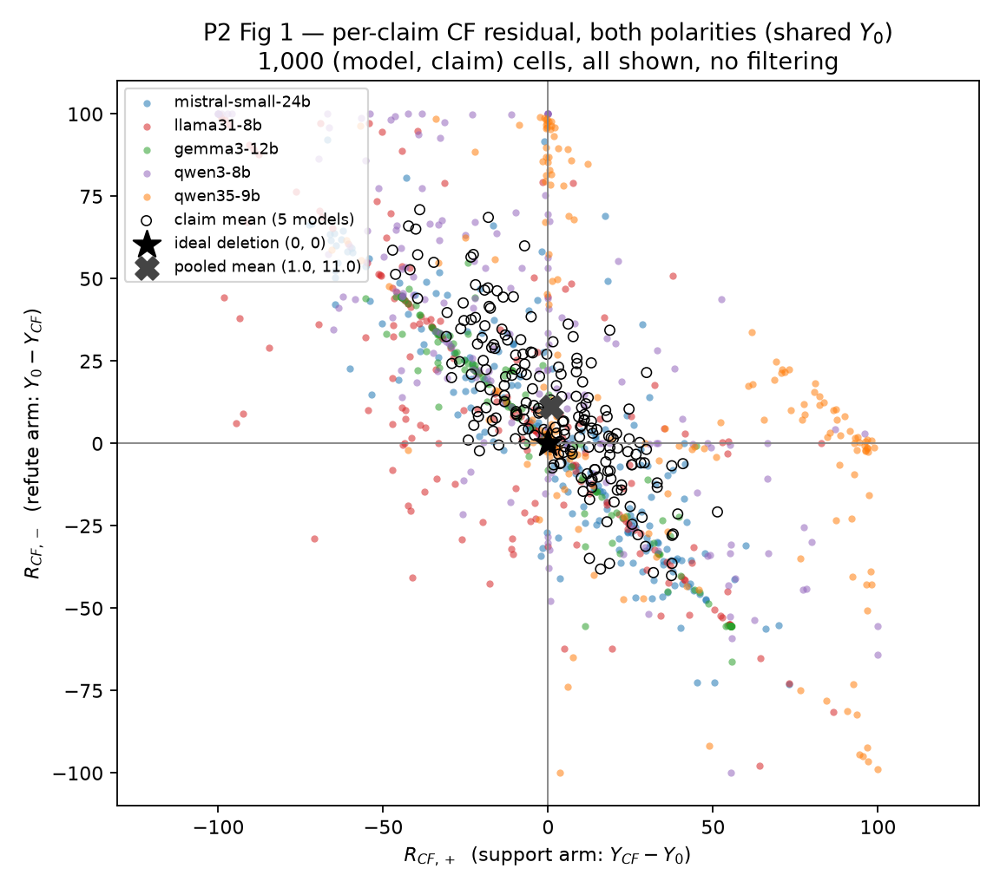
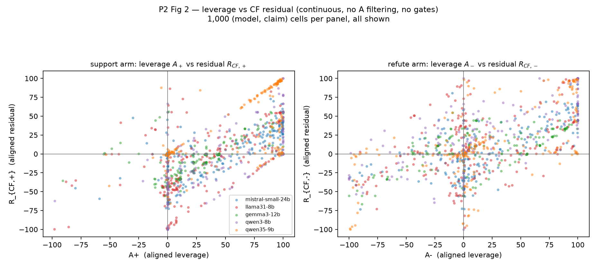

# G24A P2 — requested descriptive figures + discovery-only lineage (v1, 2026-09-26)

Addendum to the frozen §9 readout `g24a_p2_analysis_v1.md` (that file is unchanged).
Everything below is descriptive: **no gates, no A-filtering, no cells added, no
estimands changed, nothing re-run.** The two figures were requested by the user on
2026-09-26 after the readout, as diagnostics only; they carry no decision role.

## 0. Lineage: discovery-only (user ruling 2026-09-26)

The final 200 P2 claims (VitaminC `meta.split`: **train 156 / dev 23 / test 21**)
are registered **discovery-only**. This run is a discovery pilot. If the RQ stands,
any future confirmation must draw a **fresh set from cases/claims not used here**;
these 200 must never be repackaged as confirmatory evidence.

## 1. Integrity re-check (2026-09-26)

`python scripts/check_g24a_p2_raws.py --require5` → OK: 9,000 rows
(5 models × 1,800), full panel 200 claims × 9 cells × 5 models, unparsed = 0,
digit-mass < 0.5 = 0. Unchanged since `cabfc34`.

## 2. Figure 1 — per-claim CF residual, both polarities (shared Y0)

Ideal deletion = star at origin. Colored points = 1,000 (model, claim) cells;
black circles = 200 claim means (5-model average).

Structural readings (descriptive):

- **Strong anti-diagonal**: corr(R_CF,+, R_CF,−) = **−0.654** across cells,
  **−0.774** across claim means. Per claim, the two arms' CF outcomes land at
  nearly the *same* value (Y+CF ≈ Y−CF) but that shared landing is often **not Y0**
  — the dominant per-claim mode is polarity-*shared* displacement, not
  polarity-opposed residual.
- Pooled means sit near the origin (1.0, 11.0) but that masks dispersion:
  R_CF,+ quantiles [p10..p90] = −45.2 … +55.5; R_CF,− = −40.1 … +66.3.
- Arm separation: 56.32 at Admit → **12.01 at CF (79% erased)**; shared drift of
  both arms' landing vs Y0 = **−5.04** (slightly below base).
- Near-perfect restoration (both |R| ≤ 5): **11/200 claims**; claim-mean |ΔR| ≤ 5:
  **18/200**.

## 3. Figure 2 — leverage vs CF residual (continuous, no A filtering)

- Positive leverage–residual relation in both panels: cells where the evidence
  actually moved the judgment (large A) tend to retain the largest CF residuals
  (up to full persistence); cells with small A center slightly *below* zero
  (over-correction).
- A separate vertical column exists where the evidence did nothing at Admit
  (|A+| ≤ 1: 186/1000, of which |R_CF,+| > 20: **102**; |A−| ≤ 1: 143/1000, of
  which |R_CF,−| > 20: **75**) — i.e. the CF instruction moves judgments by > 20
  points even on cells where Admit produced no movement. Residual is therefore
  *not* only a function of prior update size.

## 4. Distributions and per-model ΔR (frozen quantities, nothing filtered)

A quantiles [p10, p25, p50, p75, p90]:

| aligned A | p10 | p25 | p50 | p75 | p90 | mean |
|---|---:|---:|---:|---:|---:|---:|
| A+ (support) | −0.4 | 0.5 | 31.1 | 84.2 | 98.2 | 39.10 |
| A− (refute) | −43.8 | −6.6 | 4.5 | 55.9 | 95.0 | 17.23 |

(Refute updates are weaker and much more often wrong-signed: aligned A < 0 =
138/1000 vs 354/1000 — reported continuously, never used to select.)

Per model — R_CF,+ / R_CF,− / ΔR_CF = R+ − R−:

| model | A+ | A− | R_CF,+ | R_CF,− | ΔR_CF |
|---|---:|---:|---:|---:|---:|
| mistral-small-24b | 49.93 | 16.81 | 1.24 | 2.25 | −1.01 |
| llama31-8b | 27.78 | 11.18 | −13.22 | 9.85 | −23.07 |
| gemma3-12b | 29.43 | 19.24 | −5.89 | 6.12 | −12.01 |
| qwen3-8b | 37.96 | 20.99 | −6.49 | 25.03 | −31.52 |
| qwen35-9b | 50.39 | 17.91 | 29.20 | 11.97 | **+17.23** |

Pooled: R_CF,+ = 0.97, R_CF,− = 11.04, ΔR_CF = −10.07. Direction (ΔR < 0) holds
in **4/5 models**; qwen35-9b reverses with a large support-side residual (+29.20).

## 5. Deferred steps (status only)

- **P1 §10 qualitative reading**: already executed before the 2026-09-26 ruling
  (`99b66e7` sample preserved untouched, `ed0bafa` labels + report). Its
  interpretation is deferred: per the ruling it only earns attention if P2 shows
  support-side overshoot; pooled P2 R_CF,+ ≈ 0 (though Exclude/Strong sit at
  −2.84/−3.65 with 506/544 of 1000 cells below Base). No deletion, no edits.
- **Novelty search**: halted per the same ruling. The arXiv-only sweep
  (`dc8c543`, completed before the ruling) is frozen as-is; its scope may be
  superseded once the P2 outcome fixes the story shape.
